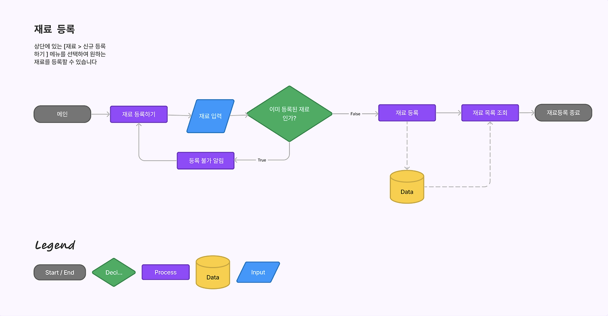
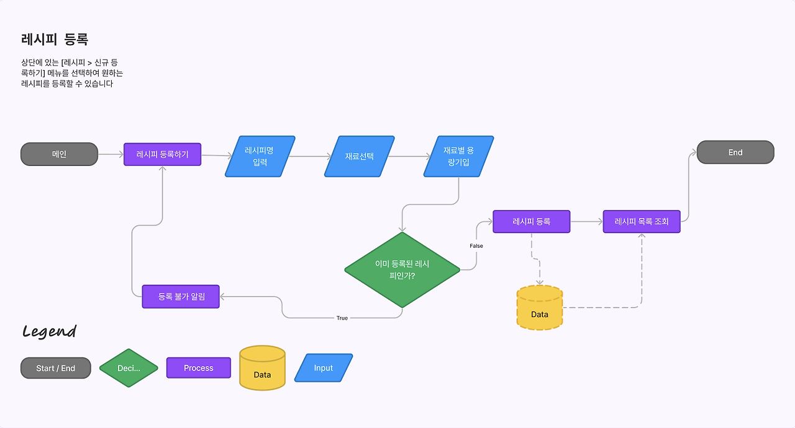
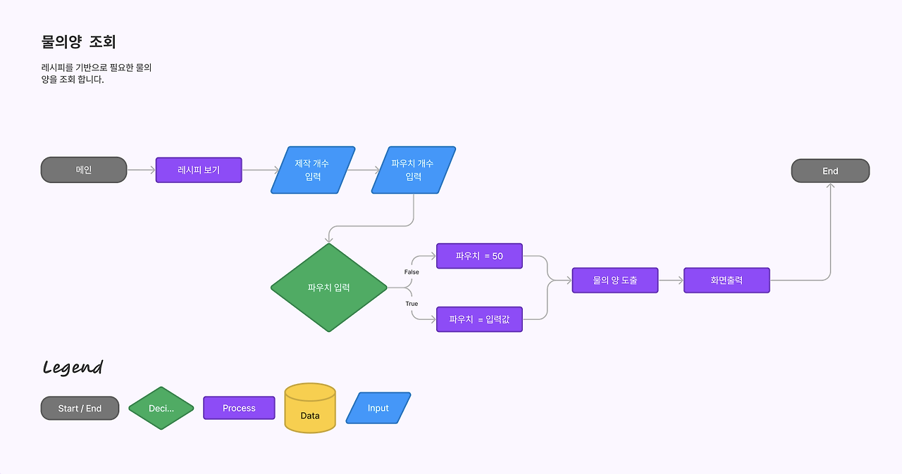

# uk_medicine

----

JPA 실습을 위한 토이 프로젝트 입니다.

연관관계 연습을 위해 기본적인 CRUD 를 구현합니다.

주요 설계는 다음과 같습니다.

----

+ 배포방법은 다음 링크를 참조해주세요

<https://zigo-autumn.tistory.com/entry/%EA%B0%9C%EC%9D%B8%ED%94%84%EB%A1%9C%EC%A0%9D%ED%8A%B8Ukmedicine4>
